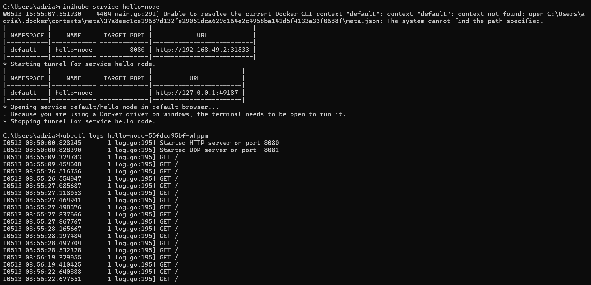

# adpro-week11

## 1st Reflection

1. Compare the application logs before and after you exposed it as a Service. Try to open the app several times while the proxy into the Service is running. What do you see in the logs? Does the number of logs increase each time you open the app?

- Yes, there is a noticeable difference in the application logs before and after the service is exposed. Once the service is exposed, it can receive requests, which are then recorded in the logs. For example, if you refresh the “hello-node” service multiple times, each request will be logged, as shown in the provided logs.

 

2. Notice that there are two versions of `kubectl get` invocation during this tutorial section. The first does not have any option, while the latter has `-n` option with value set to `kube-system`. What is the purpose of the `-n` option and why did the output not list the pods/services that you explicitly created?

- The difference between the two kubectl get invocations is that the latter uses the -n option with the value set to kube-system. The -n option specifies the namespace from which we want to retrieve services. This is necessary when there are multiple services with the same name spread across different namespaces. By using -n, we focus the retrieval on the specified namespace, ensuring we get the correct services.

