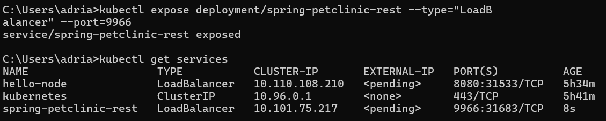

# adpro-week11

## 1st Reflection

1. Compare the application logs before and after you exposed it as a Service. Try to open the app several times while the proxy into the Service is running. What do you see in the logs? Does the number of logs increase each time you open the app?

- Yes, there is a noticeable difference in the application logs before and after the service is exposed. Once the service is exposed, it can receive requests, which are then recorded in the logs. For example, if you refresh the “hello-node” service multiple times, each request will be logged, as shown in the provided logs.

 

2. Notice that there are two versions of `kubectl get` invocation during this tutorial section. The first does not have any option, while the latter has `-n` option with value set to `kube-system`. What is the purpose of the `-n` option and why did the output not list the pods/services that you explicitly created?

- The difference between the two kubectl get invocations is that the latter uses the -n option with the value set to kube-system. The -n option specifies the namespace from which we want to retrieve services. This is necessary when there are multiple services with the same name spread across different namespaces. By using -n, we focus the retrieval on the specified namespace, ensuring we get the correct services.

## 2nd reflection

1. What is the difference between Rolling Update and Recreate deployment strategy?

The main difference between the Rolling Update and Recreate deployment strategies lies in how they handle application updates.
With the Recreate strategy, there is a period of downtime during the application update. This is because the strategy requires the existing application to be deleted before the new version is deployed. Therefore, there is a downtime period between the deletion of the old application and the completion of the new deployment.
On the other hand, the Rolling Update strategy gradually updates the application to the latest version without any downtime. It does this by incrementally updating pods with new ones, ensuring that the service remains available throughout the entire update process.
So, in summary, if avoiding downtime is a priority, the Rolling Update strategy would be the preferred choice. However, if the application requires a fresh start with each update, the Recreate strategy might be more suitable.

2. Try deploying the Spring Petclinic REST using Recreate deployment strategy and document your attempt.

make springboot-petclinic-rest in 3.0.2 version

Check if the update is sucessful

*this is if the update unsucessful

we can rollback if the update is unsucessful and all should be running again 

This is the app when we run the program

after we can run the app, and the app is as the picture above, we have sucessfully made the app

3. Prepare different manifest files for executing Recreate deployment strategy.

we will make the deployment.yaml file into 2 files called deployment_recreate.yaml for recreating the app, and deployment_rolling_update.yaml for rolling update. To differentiate these 2 yamls, we can change the type of strategy in the yaml files.

We will import each into the app
rolling update:

Recreate:

Therefore, we can conclude that bost strategies work and can pick either for our deployment

4. What do you think are the benefits of using Kubernetes manifest files?  
The benefits of using Kubernetes manifest files are primarily centered around efficiency. There’s no longer a need to memorize the procedures and syntax required for updates or initial deployments. It’s similar to importing a file into a document; we don’t need to know how the document was created, just that we now have a ready-to-use document. This also means there’s a reduced chance of human error because with manifest files, the services created are guaranteed to match the contents of the file, avoiding the mistakes programmers can make when typing out the syntax one by one.